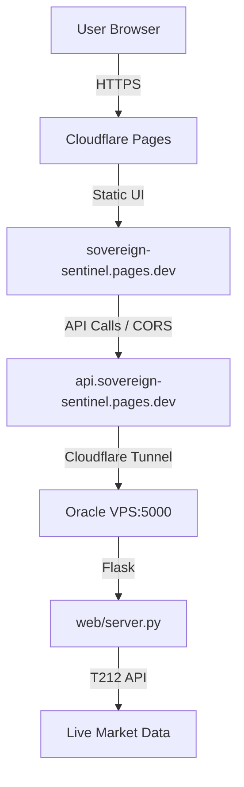

# Sovereign Sentinel - Complete System Specification (v2.0.0)

**Version:** v2.0.0 (THE SOVEREIGN DASHBOARD)
**Status:** PRODUCTION / LIVE / HYBRID
**Last Updated:** 2026-02-09
**Codename:** Neon Sentry

---

## 1. System Overview

**Sovereign Sentinel** is a consolidated, high-integrity autonomous trading system and real-time dashboard. In v2.0.0, the system has evolved into a **Hybrid Deployment Model** to balance performance, security, and accessibility.

### Core Philosophy (v2.0.0)
- **Hybrid Delivery:** Static frontend on Cloudflare Pages; live API backend on Oracle VPS.
- **Real-Time Visibility:** Live Trading 212 API integration for instantaneous portfolio monitoring.
- **Zero-Waste Aesthetics:** "Industrial Monochromatic" / "Hybrid Light Theme" using system fonts for maximum focus and efficiency.
- **Operational Autonomy:** The "Proving Ground" model (Seed vs. Harvest) remains the core risk management logic.

---

## 2. Architecture & File Manifest

### 2.1 The "Sovereign Engine"
Unified logic for execution, analysis, and dashboard serving.

| File | Purpose | Key Capabilities |
|------|---------|------------------|
| `trading212_client.py` | **Hybrid Engine** | - Consolidated Logic - Gemini 2.5 Flash + Grounding - T212 API Execution |
| `web/server.py` | **Dashboard Backend** | - Flask-based API - Real-time Sector Calculation - Tactical Brief Generation - CORS enabled for Cloudflare Pages |
| `web/templates/index.html` | **Dashboard UI** | - Hybrid Light Theme - ApexCharts Heatmap & Equity Curve - Live Sniper Command Table |
| `main_bot.py` | **Job C Executor** | - US Market Scalper (14:25 UTC) - Opening Range Breakout (ORB) |
| `auditor.py` | **The Gauntlet** | - Risk limits & Logic gates (Iron Seed Protocol) |

### 2.2 Frontend (Cloudflare Pages)
- **Location**: `dist/` folder (local) -> `sovereign-sentinel.pages.dev` (live)
- **Framework**: Semantic HTML5, Vanilla JS, ApexCharts.
- **Config**: `dist/config.js` manages environment-aware API endpoints.

---

## 3. Deployment Architecture (v2.0.0)

### 3.1 The Hybrid Model

### 3.2 Connectivity
- **Frontend URL**: `https://sovereign-sentinel.pages.dev`
- **Backend API**: `https://api.sovereign-sentinel.pages.dev`
- **Tunneling**: `cloudflared` tunnel (sovereign-api) routes traffic to local Flask server.

---

## 4. Web UI Features & Logic

### 4.1 Precision Dashboard
- **Sentinel Laboratory**: Seed (£1,000) vs. Harvest (Realized Profit) tracking.
- **Global Momentum**: Real-time performance heatmap (Treemap) with 4-tier color banding.
- **Sector Deltas**: Live allocation vs. Target analysis across 10 core sectors.
- **Tactical Brief**: AI-driven analysis combining Market Phase (BULL/BEAR) and Sector Positioning.

### 4.2 Job C Sniper Command
- **Live Integration**: Fetches Opening Range targets from `data/orb_targets.json`.
- **Execution Bridge**: One-click "BUY" button triggers `/api/execute` (vetted by `auditor.py`).
- **Metrics**: Real-time RVOL, ORB High, and Signal status.

---

## 5. Design System: Hybrid Light Theme

The system utilizes a high-efficiency industrial design language.

- **Typography**: System Font Stack (`-apple-system`, `BlinkMacSystemFont`, `Segoe UI`, `Roboto`) for zero-latency rendering.
- **Palette**:
    - **Backdrop**: `#f5f7f9` (Light Slate)
    - **Accent**: `#00A7E1` (Trading 212 Blue)
    - **Success**: `#34c759` (Apple Green)
    - **Danger**: `#ff3b30` (Alert Red)
- **Principles**: Mobile-responsive grid, floating section labels, and transparent ApexCharts.

---

## 6. Operational Protocols

### 6.1 VPS Management (Skill: vps-management)
Updates to the live backend are managed via the `vps-management` skill:
- **Keys**: `C:\Users\steve\Sovereign-Sentinel\Stores\ssh-key-2026-02-08.key`
- **User**: `ubuntu@145.241.226.107`
- **Service**: `sovereign-web.service` (controlled via `systemctl`)

### 6.2 Deployment Pipeline
1. **Local**: Dev & Test in `web/`
2. **GitHub**: Push to `main` triggers Cloudflare Pages deploy.
3. **VPS**: `scp` or `git pull` updates logic; `systemctl restart` applies changes.

---

## 7. Authentication & Security (Hardened)

| Variable | Scope | Required |
|----------|-------|----------|
| `TRADING212_API_KEY` | VPS & Local | **YES** |
| `CLOUDFLARE_API_TOKEN` | GitHub Secrets | **YES** (for deploy) |
| `GOOGLE_API_KEY` | VPS | **YES** (for AI Brief) |
| `TELEGRAM_TOKEN` | VPS | **YES** (for Execution Alerts) |

---

## 8. The Iron Seed Protocol (v2.0.0 Integration)
The Dashboard and Backend now strictly visualize and enforce the **£1,000 Max Exposure** limit. The "Harvest" donut segment only illuminates once Realized Profit is positive, strictly following the "Proving Ground" mandate.

---

**[END OF SPECIFICATION v2.0.0]**
